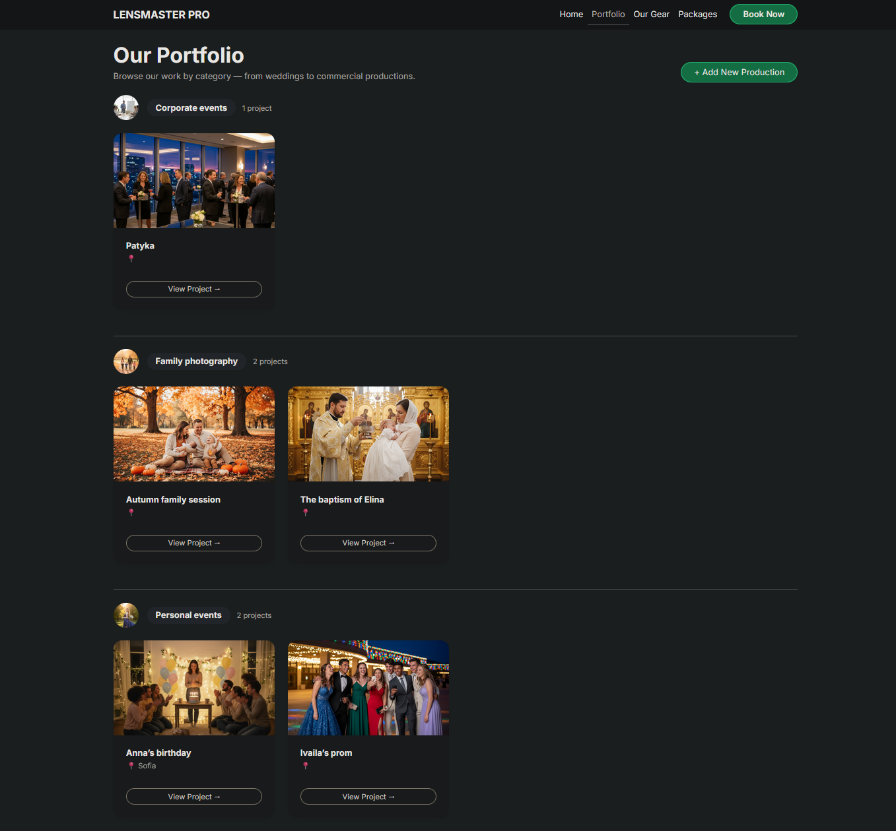
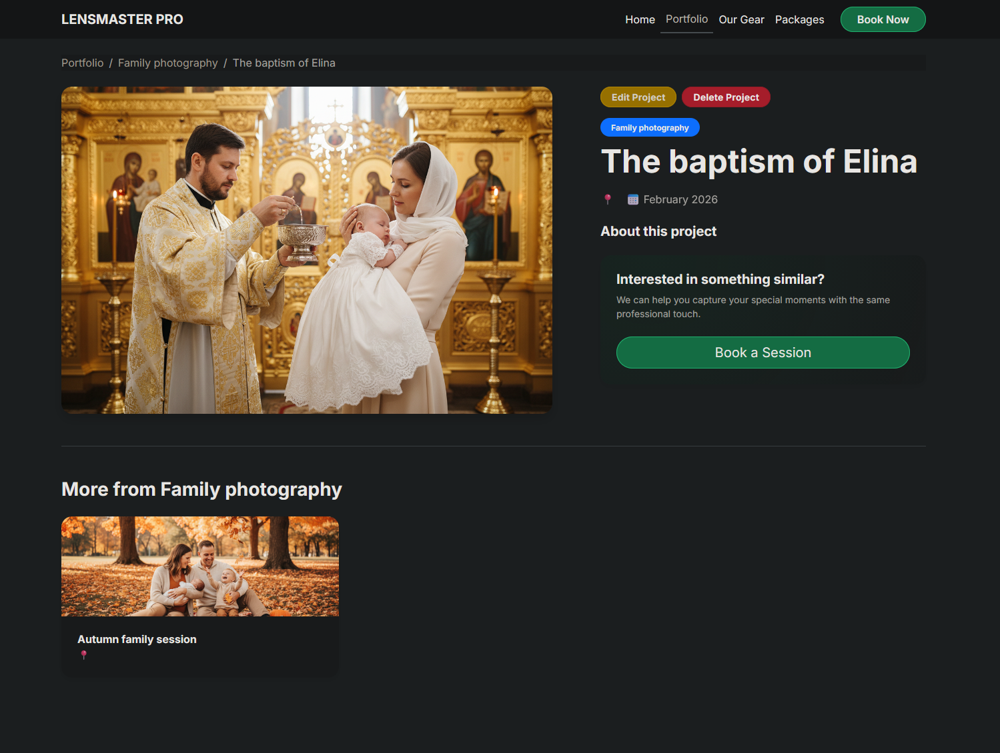

# 📷 LensMaster Pro


**LensMaster Pro** is a professional Django web application designed for photography and videography studios. It features a curated portfolio, service package management, client booking requests, and a studio equipment inventory system.

---

## 📌 Table of Contents
- [✨ Key Features](#-key-features)
- [🏗️ Architecture Overview](#️-architecture-overview)
- [🧭 Site Map & Operations](#-site-map--operations)
- [🗂️ Directory Structure](#️-directory-structure)
- [🚀 Installation & Setup](#-installation--setup)
- [🌐 Live Demo](#-live-demo)
- [🖼️ Screenshots](#️-screenshots)
- [🧪 Data Management](#-data-management)
- [🧩 Custom 404 Page](#-custom-404-page)
- [🗃️ Tech Stack](#️-tech-stack)

---

## ✨ Key Features
- **Multi-app Architecture**: Clean separation of concerns between Bookings, Productions, Inventory, and Common utilities.
- **Full CRUD Functionality**: Complete management systems for **Productions** and **Service Packages**.
- **Dynamic Portfolio**: Categorized project showcase with detailed production pages and related items.
- **Client Booking System**: Integrated booking request forms with robust server-side validation.
- **Inventory Tracking**: Professional equipment management with auto-generated internal inventory IDs.
- **Production Ready**: PostgreSQL integration via environment variables and custom 404 error handling.

---

## 🏗️ Architecture Overview
- **`productions/`**: Portfolio categories and project showcases (Public browsing + Staff CRUD).
- **`bookings/`**: Service packages management and client booking request flow.
- **`inventory/`**: Studio equipment and gear tracking.
- **`common/`**: Shared abstract models, mixins, and global views (Home, 404).
- **`lensmaster_pro/`**: Core project configuration and URL routing.

---

## 🧭 Site Map & Operations

| Feature / Page | Exact URL Path | Operations | Description |
| :--- | :--- | :--- | :--- |
| **Home** | `/` | View | Featured categories and latest studio work. |
| **Portfolio Categories** | `/portfolio/categories/` | View | Browse all production categories. |
| **Category Details** | `/portfolio/category/<slug>/` | View | List productions within a specific category. |
| **Production Details** | `/portfolio/production/<slug>/` | View | Detailed view of a specific project. |
| **Manage Productions** | `/portfolio/add/` | **Full CRUD** | Create, Edit, and Delete production items. |
| **Service Packages** | `/bookings/packages/` | **Full CRUD** | List and manage photography/video tiers. |
| **Booking Request** | `/bookings/request/` | Create | Client intake form with validation. |
| **Inventory** | `/inventory/` | View | Internal list of studio gear grouped by type. |
| **Admin Panel** | `/admin/` | All | Full database management for staff. |

---

## 🗂️ Directory Structure

```text
lensmaster_pro/
|-- bookings/          # Service packages & client booking requests
|-- productions/       # Portfolio categories & project showcases
|-- inventory/         # Studio equipment & gear tracking
|-- common/            # Shared abstract models, mixins & utilities
|-- lensmaster_pro/    # Core project configuration (settings, urls)
|-- static/            # Global CSS, JavaScript, and images
`-- templates/         # HTML templates organized by application module
```

---

## 🚀 Installation & Setup

### 1) Clone the repository
```bash
git clone https://github.com/AlAleksandrov/lensmaster_pro.git
cd lensmaster_pro
```

### 2) Environment Setup
```bash
# Create and activate virtual environment
python -m venv .venv

# Windows:
.venv\Scripts\activate
# macOS/Linux:
source .venv/bin/activate

# Install dependencies
pip install -r requirements.txt
```

### 3) Configuration
Create a `.env` file in the project root:
```env
SECRET_KEY=your-secret-key-here
DEBUG=True
ALLOWED_HOSTS=127.0.0.1,localhost

DB_ENGINE=django.db.backends.postgresql
DB_NAME=lensmaster_pro
DB_USER=postgres
DB_PASSWORD=your_password
DB_HOST=127.0.0.1
DB_PORT=5432
```

### 4) Initialize Database
```bash
python manage.py migrate
python manage.py createsuperuser
python manage.py runserver
```
Access the site at: **http://127.0.0.1:8000/**

---

## 🌐 Live Demo
A temporary live demo may be available via ngrok:
- [Live Demo Link](https://rosella-unshotted-adjustably.ngrok-free.dev/)

---

## 🖼️ Screenshots




---

## 🧪 Data Management
Authentication for the public site is intentionally excluded per exam requirements. Use the **Django Admin** to populate the site:
1. Login at `/admin/`.
2. Add **Categories** first.
3. Link **Productions** and **Service Packages** to your categories.
4. Add **Equipment** to the inventory.

---

## 🧩 Custom 404 Page
To test the custom error handler, set `DEBUG=False` in your `.env` and visit:
- `http://127.0.0.1:8000/non-existent-page/`

---

## 🗃️ Tech Stack
- **Backend**: Django (Python)
- **Database**: PostgreSQL
- **Forms**: `django-crispy-forms` with Bootstrap 5
- **Environment**: `python-dotenv`
- **Images**: Pillow
- **Frontend**: Bootstrap 5 + Custom CSS

---

## 🧾 Project Notes
- **Git History**: Includes commits on multiple separate days as required.
- **License**: Educational project for the Django Basics Exam.
